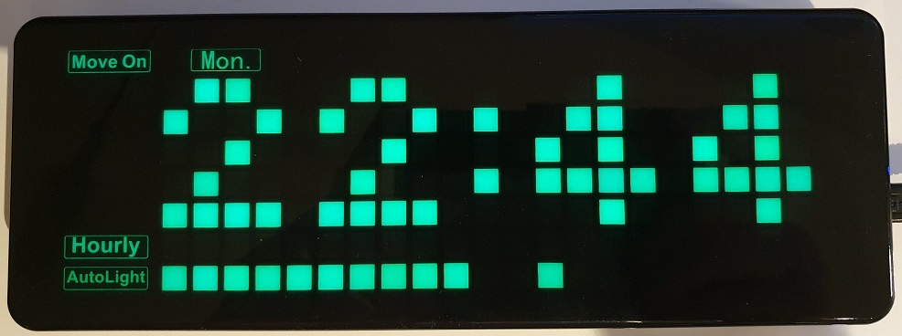

# Pico Clock Green & Easy
An easy-to-use firmware for the Waveshare Pico-Clock-Green, written in C++

# Features
## User features
- basic (also present in Waveshare's demo firmware):
    - auto scroll
    - 2 alarms (with multiple weekdays selection)
    - time format 12h or 24h
    - room temperature (using the RTC sensor)
    - countdown
    - stopwatch
    - hourly chime
    - auto light
- additional:
    - menu based user interface with horizontal and vertical scrolling
    - instant start up: no splash screen or animation, just power the device and you have a clock
    - 3 time display styles: hour:min:sec, hour:min + bar (the bar is a kind of horizontal hourglass to show seconds), hour:min
    - NTP synchronization over Wi-Fi (requires a development environment to set the SSID and password)
    - persistent saving of clock settings to flash memory
    - "sleep mode" when auto light is enabled that makes the display very dim if the room is dark and no button has been used for a while
    - optional hourly chime activation using the ambient light sensor
    - gradual alarm mode that progressively increases the duration of beeps to wake up gently
    - "skip next alarm" function: e.g. if you woke up before the alarm time or the next day is a national holiday, activate this function and the next alarm (and only this one) will be skipped. This is shown by the slow blinking of the "Alarm On" indicator.

## Technical features
- support for Pico and Pico W
- written in C++ from scratch (not based on Waveshare's demo code)
- intuitive display frame buffer structure, with one bit per pixel in displaying order
- 3 fonts (4x5 pixels monospaced, 4x7 pixels monospaced and 3x7 pixels proportional), directly modifiable in the source code
- hardware abstraction layer to facilitate porting to other platforms and adding unit tests
- led matrix controller fully driven by DMA and PIO to release the CPU and provide a more stable display (can be disabled at build time)
- use of PWM to control display brightness
- use of interrupts for buttons, with debouncing


# Installation
## From binaries

The repository contains the precompiled PicoClockGreenEasy.uf2 file that can be used to easily install the firmware on your Pico-Clock-Green device.

### Using the BOOTSEL button
- Hold the BOOTSEL button of the Pico, connect the USB interface of the Pico to your computer, then release the button.
- Copy the uf2 into the Pico drive. The Pico will run the firmware directly.

### Using picotool
If you have the Pico build environment, the firmware can be installed using picotool:
- Connect the USB interface of the Pico to your computer
- Reboot to BOOTSEL mode using picotool. This works only if the program that is running on the Pico is cooperative (e.g. if it uses stdio_usb), which is the case with this firmware.
```
picotool reboot -f -u
```
- Load and execute the firmware
```
picotool load -x ./PicoClockGreenEasy.uf2
```

## Building from the source code

- Install the Pico development environment, e.g. by following https://datasheets.raspberrypi.com/pico/getting-started-with-pico.pdf
- clone this repository locally
- configure the firmware by modifying the UserConfig.cmake file, especially if you want to use NTP synchronization over Wi-Fi
- enter the corresponding directory and configure the project
```
cmake . -Bbuild
```
- build
```
cmake --build build
```

The created build/PicoClockGreenEasy.uf2 can now be transferred to the Pico by following the instructions of the previous section.

# User manual

## Concept

The whole user interface is organized as a menu, with some functions opening sub-menus. Vertical scrolling helps users understand that they are navigating in a menu, whereas horizontal scrolling is used to display long texts, so that they do not need to be abbreviated.

The three buttons follow the assignment defined by Waveshare (from top to bottom):
- enter / set
- move up in menu
- move down in menu

Whenever a value is blinking, it can be modified using this button assignment:
- finish setting / set next value
- increase value, making bigger steps repeatedly on long-press
- decrease value, making bigger steps repeatedly on long-press

Additionally, the buttons behave slightly differently when editing the weekdays of an alarm:
- finish setting alarm weekdays
- select next weekday
- enable/disable alarm on this weekday

## Menu structure
This is the full definition of the menu structure. Use the "enter/set" button to access functions/values on the right.

- time in hour:min:sec style &rarr; set hour &rarr; set min
- time in hour:min:bar style &rarr; set hour &rarr; set min
- time in hour:min style &rarr; set hour &rarr; set min
- date &rarr; set year &rarr; set month &rarr; set day
- temperature: toggle Celcius/Fahrenheit
- alarms: enter submenu
    - (if an alarm is activated) skip next alarm: toggle on/off
    - alarm 1 &rarr; set mode &rarr; set hour &rarr; set min &rarr; set weekdays
    - alarm 2 &rarr; set mode &rarr; set hour &rarr; set min &rarr; set weekdays
    - exit: leave submenu
- countdown: enter submenu
    - countdown: start/stop 
    - set &rarr; reset countdown to start time, then set min &rarr; set sec
    - exit: leave submenu
- stopwatch: enter submenu
    - stopwatch: start/stop
    - reset: reset stopwatch to zero
    - exit: leave submenu
- wifi status (no actual function)
- options &rarr; set auto scroll &rarr; set time format &rarr; set hourly chime &rarr; set auto light

## Using NTP synchronization

If you have a Pico W, you can use NTP to synchronize date/time at start-up. For the moment, this requires a build environment, as the Wi-Fi SSID and password need to be configured at build time. Additional possibilities may get added in future versions.

This configuration is done by setting the WIFI_SSID and WIFI_PASSWORD macros in the UserConfig.cmake file (between the escaped quotes). Additionally, the UTC offset also needs to be set in UTC_OFFSET, as the NTP server provides UTC time and does not know where you are located. After configuring, follow the steps of the "Building from the source code" section above. 

When running the firmware, move to the "wifi status" function to check if your settings are working.